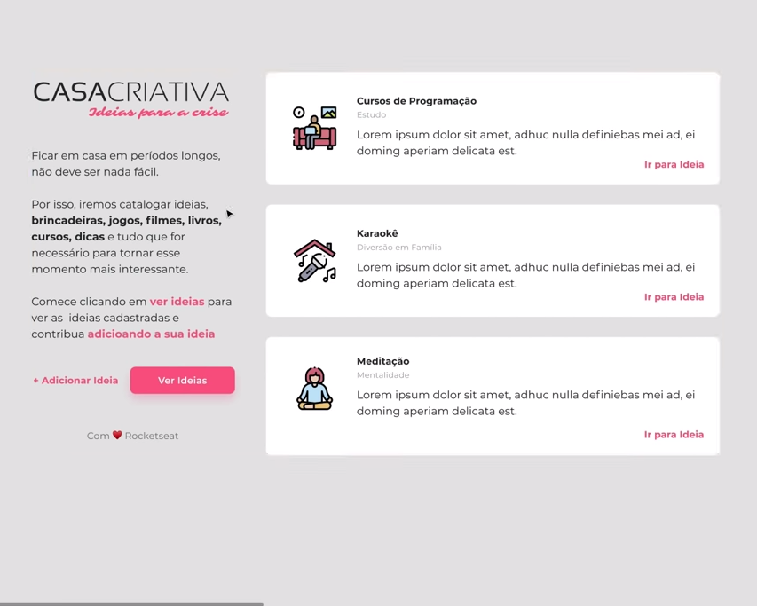

# WorkshopDev para Iniciantes by [Rocketseat](https://github.com/Rocketseat)

  

> Aplicação voltada ao cadastro de ideias de coisas para se fazer durante __crise viral__  

#### O Projeto

  Em meio a um ambiente de quarentena pandemica, a <a href="https://github.com/Rocketseat">Rocketseat</a> propoem uma
ideia de projeto onde as pessoas podem cadastrar ideias de atividades para se fazer durante a quarentena. 
  Neste <strong>WorkshopDev</strong>, <em>Mykão</em> dá dicas para que pessoas iniciantes aprimorem seus conhecimento, ou adiquiram, em <strong>HTML</strong>, <strong>CSS</strong> e <strong>JavaScript</strong>.

##### That's all folks! 
